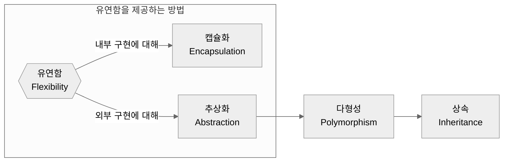
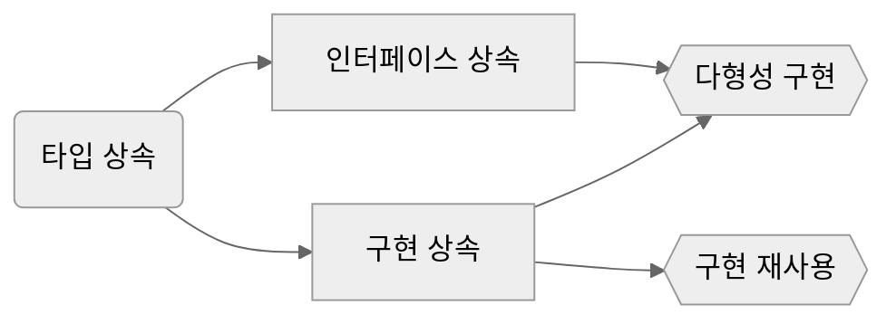
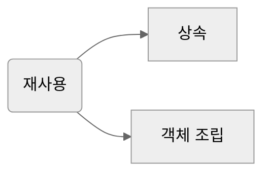

> 본문은 **“개발자가 반드시 정복해야 할 객체 지향과 디자인 패턴”**(최범균 저)을 읽고 정리한 내용입니다.

<br>

이전 글에서 다뤘던 <span class="shlb">**캡슐화**</span>란, **내부 구현의 유연함**을 달성하는 방법이었다. 

> 캡슐화에 대한 내용은 [[**링크**](/posts/what-is-object-oriented-programming/#%EC%BA%A1%EC%8A%90%ED%99%94-encapsulation)]에서 확인 가능하다!
{: .prompt-tip}

<br>

이번 글에서는 **외부 구현의 유연함**을 달성하는 방법인 <span class="shlb">**추상화**</span>를 다뤄보자!

> **▼ 객체지향에서 구현 변경의 유연함을 달성하는 방법**
> 
> | --- | --- |
> | **캡슐화** | <span class="blue">내부</span> 구현에 대한 유연함 달성 |
> | **추상화** | <span class="blue">외부</span> 구현에 대한 유연함 달성 |

이때, <span class="shlb">**다형성**</span>을 통해 **추상화**가 가능하며, **다형성의 구현**은 <span class="shlb">**타입 상속**</span>을 통해 이루어진다.

이를 다이어그램으로 나타내면 다음과 같다. 개념 하나하나를 짚으며 이해해보자!





<br>

## 상속 (Inheritance)

상속은 <span class="shl">**한 타입을 그대로 사용**하면서 **구현을 추가할 수 있도록**</span> 해주는 방법을 제공해준다. 예를 들어 기본적인 기능을 제공하고 있는 `Coupon` 클래스에 새로운 기능을 추가하고 싶다면, `Coupon` 클래스를 상속 받아 `LimitPriceCoupon` 클래스를 생성할 수 있는 것이다. 이때 `Coupon` 클래스는 **상위(super) 클래스** 또는 **부모(parent) 클래스**가 되고, `LimitPriceCoupon` 클래스는  **하위(sub) 클래스** 또는 **자식(child) 클래스**가 된다.

**상속의 특징**은 다음과 같다.

1. 자식 클래스는 부모 클래스에 정의된 구현을 물려받는다.
    
    > 다수의 언어에서는 `private` 범위를 갖는 메서드나 필드를 제외한 나머지를 물려받을 수 있도록 한다.
    
2. 하위 클래스에서는 필요에 따라 **재정의(overriding)**를 통해 상위 클래스에 정의된 메서드를 새롭게 구현할 수도 있다.

<br>

## 다형성 (Polymorphism)

다형성이란 <span class="shl">**한 객체가 여러 타입을 가질 수 있다**</span>는 것을 뜻한다. 즉, 어떤 객체가 타입 A, 타입 B, 타입 C에 정의된 인터페이스의 구현을 제공한다면, 다른 코드에서는 이 객체를 타입 A로도, 타입 B로도, 타입 C로도 사용할 수 있는 것이다.

자바와 같은 **정적 타입 언어**에서는 **타입 상속을** 통해서 다형성을 구현하는데, 다음의 예시 코드를 살펴보면 다음과 같다.

```java
public class Plane {
    public void fly() {
        ...
    }
}

public interface Turbo {
    public void boost();
}

public class TurboPlane extends Plane implements Turbo {
    public void boost() {
        ...
    }
}
```

1. `TurboPlane` 타입의 객체는 `Plane` 타입과 `Turbo` 타입에 정의된 모든 기능을 제공한다.
2. `TurboPlane` 타입의 객체는 `Plane` 타입이나 `Turbo` 타입도 될 수 있다.

반면, **동적 타입 언어**에서는 명시적으로 타입을 지정하지 않아도 타입에서 요구하는 오퍼레이션을 제공할 수 있기 때문에, 타입 상속 없이도 다형성을 구현할 수 있다.

<br>

### 타입 상속의 두 가지 종류: 인터페이스 상속, 구현 상속




Java, C++, C# 등의 언어는 **다형성을 구현**하기 위해 **타입 상속**을 이용하며, 타입 상속은 크게 인터페이스 상속과 구현 상속으로 구분할 수 있다.

- <span class="shlp">**인터페이스 상속**</span>: 순전히 타입 정의만을 상속받아 <span class="blue">**다형성**</span>만을 구현한다. (ex. 인터페이스, 추상 클래스)
- <span class="shlp">**구현 상속**</span>: 클래스 상속을 통해 <span class="blue">**다형성**</span>을 구현할 수 있을 뿐만 아니라 <span class="blue">**구현을 재사용**</span>할 수도 있다. (재정의 가능)

<br>

## 추상화 (Abstraction)

추상화란 <span class="shl">**데이터나 프로세스 등을 의미가 비슷한 개념이나 표현으로 정의하는 과정**</span>이다. 추상화는 **기능** 뿐만 아니라 **타입**에도 적용할 수 있는데, 이러한 경우에는 여러 구현 클래스를 추상화함으로써 **인터페이스를 도출**할 수 있게 된다. 이렇게 **추상화된 타입**은 오퍼레이션의 시그니처만 정의할 뿐, 실제 구현을 제공하지는 못한다. 따라서 일반적으로 구현을 제공하지 않는 타입(ex. Java의 인터페이스, C++의 추상 메서드로만 구성된 추상 클래스)을 이용하여 정의한다.

**추상 타입**과 **실제 구현 클래스**는 <span class="bluev">**상속**</span>을 통해 연결한다. 즉, 구현 클래스가 추상 타입을 상속 받는 방법으로 연결하며, 이때 각 구현 클래스들은 실제 구현을 제공한다는 의미에서 **콘크리트 클래스(concrete class)**라고 부른다.

{: .w-75}

이렇게 하면 다음과 같이 추상 타입을 이용해서 코드를 작성할 수 있다.

```java
LogCollector collector = createLogCollector();
collector.collect();
```

<br>

### 추상 타입을 사용하는 이유

> 콘크리트 클래스를 직접 사용해도 문제가 없는데, 추상 타입을 사용하는 이유는 무엇일까?
> 

우선, **추상화로 얻을 수 있는 이점**은 다음과 같다.

1. 상세 구현에 대해 공통된 개념을 도출해서 **추상 타입**을 정의하면, 여러 콘크리트 클래스를 통해 **다형성**을 이용할 수 있다.
2. 많은 책임을 가진 객체로부터 **책임을 분리**할 수 있도록 해준다.

이러한 점을 통해 추상 타입을 사용하는 코드에 영향을 주지 않으면서, 추상 타입의 실제 구현(콘크리트 클래스)을 변경할 수 있기 때문에 추상 타입을 사용하는 것이다.

<br>

> 추상 타입을 통해 <span class="shl">**변경의 유연함**</span>을 얻을 수 있다!
{: .prompt-info}

<br>

### 인터페이스를 사용할 때 유의할 점

1. <span class="shlp">**인터페이스에 대고 프로그래밍 하자. (program to interface)**</span>
    
    실제 구현을 제공하는 콘크리트 클래스를 사용해서 프로그래밍하지 말고, 기능을 정의한 인터페이스를 사용해서 프로그래밍하라는 뜻이다. 즉, **추상화를 통해 유연함**을 얻기 위한 것이다.
    
    하지만 인터페이스를 모든 곳에서 사용하면 프로그램의 복잡도가 커지기 때문에, **변화 가능성이 높은 경우**에 한해서 사용해야 한다.
    
2. <span class="shlp">**인터페이스는 인터페이스의 사용자 입장에서 만들자.**</span>
    
    인터페이스를 작성할 때는 인터페이스를 사용하는 코드 입장에서 작성해야 한다.
    
3. <span class="shlp">**테스트 시, 사용할 대상을 인터페이스로 추상화하면 좀 더 쉽게 Mock 객체를 만들 수 있다.**</span>
    
    이처럼 테스트를 할 수 없게 만드는 부분을 별도의 인터페이스로 분리하게 되면, Mock 객체를 통해 실제 사용할 콘크리트 클래스의 구현 없이 테스트할 수 있다.
    
    이렇게 분리되는 인터페이스는 테스트 대상이 되는 클래스와 구분되는 책임을 가지게 되는 경우가 많으며, 이는 곧 새로운 책임을 갖는 객체를 도출하게 된다는 것을 의미한다. 즉, TDD는 테스트를 강제함으로써 알맞은 책임을 가진 객체를 도출하도록 유도하는 것이고, 결국 객체지향 설계를 유도하는 방식이 된다.
    

<br>

## 재사용 (Reuse)

상속을 사용하면 재사용을 쉽게 할 수 있기는 하나, 몇 가지 문제점이 발생할 수 있다. 그 문제점이 무엇인지, 그리고 다른 재사용 방법인 객체 조립을 통해 그 문제점을 해소하는 방법에 대해 알아보자!



<br>

### <span class="blue">상속</span>을 이용한 재사용의 문제점

> 상속을 사용하면 쉽게 다른 클래스의 기능을 재사용하면서 추가 기능을 확장할 수 있다. 하지만 <span class="shl">**변경의 유연함**</span>이라는 측면에서 치명적인 단점을 가지고 있다.
{: .prompt-tip}

1. <span class="shlp">**상위 클래스 변경의 어려움**</span>
    
    어떤 클래스를 상속받는다는 것은 그 클래스에 **의존한다**는 뜻이다. 따라서 상위 클래스를 변경하면 그 여파가 하위 클래스로 전파되게 되므로, 클래스 계층도가 커질수록 상위 클래스를 변경하는 것이 어려워진다.
    
2. <span class="shlp">**클래스의 불필요한 증가**</span>
    
    유사한 기능을 확장하는 과정에서 클래스의 개수가 불필요하게 증가할 수 있다. 필요한 기능의 조합이 증가할수록, 상속을 통해 기능 재사용을 하게 되면 클래스의 개수가 증가하게 된다.
    
3. <span class="shlp">**상속의 오용**</span>
    
    상속은 **IS-A 관계**가 성립할 때에만 사용해야 한다. IS-A 관계가 아닌 경우에 상속을 사용하면, 서로 다른 책임을 가지는 관계이므로 원하는 방식으로 동작하지 않을 수 있다.
    
    > **IS-A 관계**란, “~은 ~이다”가 성립하는 관계로, 일반적인 개념과 구체적인 개념 사이에 성립한다.
    {: .prompt-info}

<br>

### <span class="blue">객체 조립</span>을 이용한 재사용의 장점

> 객체지향 언어에서 객체 조립은 보통 **필드에서 다른 객체를 참조하는 방식**으로 구현된다. 즉, 다른 객체의 기능을 사용하는 것이다. 이처럼 다른 객체에게 할 일을 넘기는 것을 **위임(delegation)**이라 한다.
{: .prompt-tip}

1. <span class="shlp">**상속을 이용할 때 발생하는 문제점 해결**</span>

    1. 다른 클래스의 구현에 의존하지 않으므로, 상위 클래스 변경이 어려워지는 문제가 발생하지 않는다.
    2. 기능을 제공하는 클래스들을 조립해서 사용하므로, 기능을 추가한다고 하더라도 하위 클래스의 개수가 늘어나지 않는다.
    3. 상속을 잘못 사용해서 발생할 수 있는 문제도 발생하지 않는다.

2. <span class="shlp">**런타임에 조립 대상 객체 교체 가능**</span>
    
    상속의 경우 소스코드 작성 시점에 관계가 형성되므로 런타임에 상위 클래스를 교체할 수 없으나, 조립의 경우 코드 상에서 런타임에 사용할 객체를 변경할 수 있다.
    

<br>

> 객체 조립을 사용한다면 상대적으로 런타임 구조가 복잡해지고 구현이 어렵다는 단점이 존재하기는 하지만, 변경의 유연함을 확보하는 데에서 오는 장점이 더 크기 때문에 기능을 재사용해야 한다면 상속보다는 조립하는 방법을 먼저 고려하자.
{: .prompt-info}

<br>

### 상속은 언제 사용할까?

상속은 재사용이라는 관점이 아닌, <span class="shl">**명확한 IS-A 관계에서 기능을 점진적으로 확장할 때**</span> 사용해야 한다.

하지만 처음에는 명확한 IS-A로 보여서 상속을 통해 기능을 확장했더라도 이후에 상속의 문제점들이 발견된다면, 객체 조립으로 전환하는 것을 고려해야 한다.
