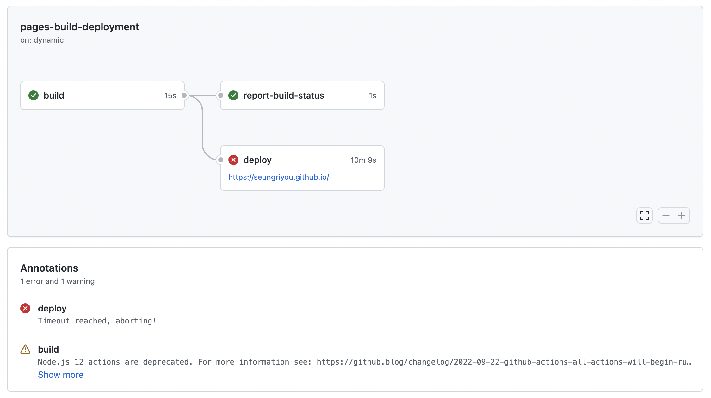
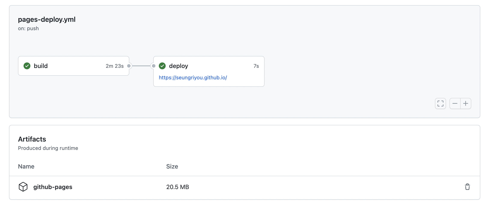

평소처럼 블로그 글을 쓰고 `git push`를 했는데 `GitHub Actions`의 Workflow에서 deploy 중 타임아웃 에러가 발생하였다. 나는 블로그를 `chirpy` repository에서 `fork` 해서 사용하지 않고 `clone` 하여 사용 중이어서 늘 업데이트 때마다 수동으로 로그를 보고 고쳐야 하기 때문에, 이번 문제도 왠지 업데이트 때문에 발생하는 문제인 것 같아 release 기록을 우선 살펴보았다. 그 결과, 역시나 업데이트가 원인이었다 😭 (GitHub Page의 deployment가 개선되었다고 한다.)

<br>


_GitHub Actions에서 발생한 오류_

<br>

`chirpy`의 최근 업데이트 `v5.3.0`([**참고 링크**](https://github.com/cotes2020/jekyll-theme-chirpy/releases/tag/v5.3.0)) 및 docs 업데이트([**참고 링크 1**](https://chirpy.cotes.page/posts/getting-started/#deploy-by-using-github-actions), [**참고 링크 2**](https://github.com/cotes2020/jekyll-theme-chirpy/blob/v5.3.0/.github/PULL_REQUEST_TEMPLATE.md))를 참고하여 다음을 수행하였다.

1. `tools/test.sh`([**참고 링크**](https://github.com/cotes2020/jekyll-theme-chirpy/blob/v5.3.0/tools/test.sh))를 생성한 후, 다음의 명령어가 잘 실행되는지 확인한다.

    ```shell
    bash ./tools/test.sh
    ```

2. `.github/workflows`의 기존 `pages-deploy.yml`의 내용을 [**pages-deploy.yml.hook**](https://github.com/cotes2020/jekyll-theme-chirpy/blob/v5.3.0/.github/workflows/pages-deploy.yml.hook)의 내용으로 바꾸고, `on.push.branches`를 내가 사용 중인 `master`만 남겨둔다.

3. 다시 `git push` 하여 deploy가 잘 되는지 확인한다.

4. 기존의 `gh-pages` branch와 `tools/deploy.sh`는 삭제해도 된다.

<br>


_문제 해결 후 GitHub Actions의 실행 결과_

<br>

앞으로 업데이트 때마다 수많은 에러를 마주할 생각을 하니 눈앞이 깜깜하다. ㅠㅠ 업데이트가 상대적으로 쉬워보이는 [**gem을 사용하는 방법**](https://chirpy.cotes.page/posts/getting-started/#upgrading)에 대해서 한 번 알아봐야 할 듯 하다.

<br>

<hr>

<br>

Chirpy theme의 [Upgrade Guide](https://github.com/cotes2020/jekyll-theme-chirpy/wiki/Upgrade-Guide)를 참고하면 다음과 같이 업그레이드 내역을 확인할 수 있다고 한다. 


```
https://github.com/cotes2020/chirpy-starter/compare/<older_version>...<newer_version>
```


예를 들어 `v4.0.0`에서 `v5.0.0`로 업그레이드 시, 다음의 링크로 접속하면 변경 내역을 확인할 수 있다.

https://github.com/cotes2020/chirpy-starter/compare/v4.0.0...v5.0.0
